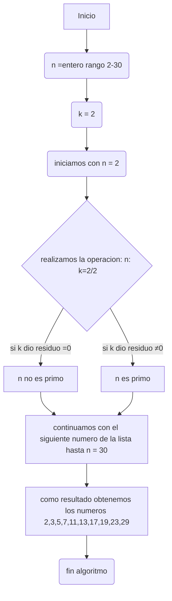

# Reto_3
##En este repositorio encontraremos los pasos a seguir para hallar los numeros primos desde 2 hasta n. 
###Pasos a seguir
1) Creamos una lista con los numeros desde el 2 hasta n
2) Realizar para cada numero i de la lista hecha la division entre 2 i/2
3) Evaluar si de acuerdo al residuo de la divison, pertenece o no a los numeros primos.
   3.1)Es primo: Si al evaluar el residuo de la operacion i/2 fue distinta a 0
   3.2)No es primo: Si al evaluar el residuo de la operacion i/2 es igual a 0
4) Descartamos automaticamente el 1 ya que no es un numero primo
5) Descartamos el numero 2 ya que este si es un numero primo
6) 
```pseudocode
n: rango (2-30) 
k: entero 
#Excluimos de este proceso al numero 0 y 1
[0] es_primo, [1] es_primo = false
#Comenzamos tomando como valor inicial al numero n
es_primo= n/2 ≠0 
#Los numeros n que al ser divididos entre 2 den un residuo distinto a 0 son primos
escribir ("es primo")
#comprobamos esto con todos los numeros de la lista
si_es_primo Entonces
Escribir n // mostrar el numero primo
FinAlgoritmo
```
##DIAGRAMA DE FLUJO

Con este diagrama de flujo damos por finalizado y completado el reto n° 3.
Muchas gracias

